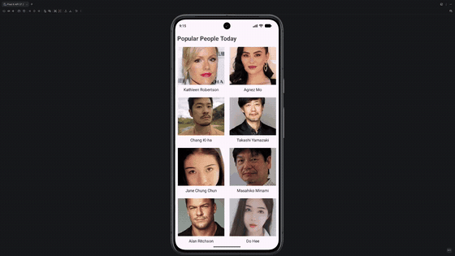

# Android Project 4 - *FlixsterPlus*

Submitted by: **Daniel Emerle**

**FlixsterPlus** is a people-browsing app that allows users to browse today's popular celebrities from The Movie Database (TMDB) API in a 2-column grid, and tap on a person to view a details screen with their headshot, known-for work (with poster), and an overview description.

Time spent: **2** hours spent in total

## Required Features

The following **required** functionality is completed:

- [x] **Choose any endpoint on The MovieDB API except `now_playing`**
  - Chosen Endpoint: [`person/popular`](https://developers.themoviedb.org/3/people/get-popular-people)
- [x] **Make a request to your chosen endpoint and implement a RecyclerView to display all entries**
- [x] **Use Glide to load and display at least one image per entry**
- [x] **Click on an entry to view specific details about that entry using Intents**
  - The details screen shows 3 pieces of data not shown in the main view: the known-for movie poster, the list of known-for titles ("Known For:"), and a description/overview.

The following **optional** features are implemented:

- [ ] **Add another API call and RecyclerView that lets the user interact with different data.**
- [ ] **Add rounded corners to the images using the Glide transformations**
- [ ] **Implement a shared element transition when user clicks into the details of a movie**

The following **additional** features are implemented:

- [ ] List anything else that you can get done to improve the app functionality!

## Video Walkthrough

Here's a walkthrough of implemented user stories:

<!-- Replace this with whatever GIF tool you used! -->
GIF created with [ffmpeg](https://ffmpeg.org/)
<!-- Recommended tools:
[Kap](https://getkap.co/) for macOS
[ScreenToGif](https://www.screentogif.com/) for Windows
[peek](https://github.com/phw/peek) for Linux. -->

## Notes

Challenges encountered while building the app:

- TMDB rejects the API key sent as an `X-Api-Key` header; the key must be passed as an `api_key` query parameter.
- The `trending/person/week` endpoint no longer returns `known_for` data, so the app was switched to `person/popular`, which includes it in the same response.
- Edge-to-edge rendering caused the header to draw underneath the camera cutout; fixed by applying `systemBars() | displayCutout()` window-insets padding to the root view.
- Gradle's JDK auto-download (foojay resolver) was broken on the build machine, so a local Temurin JDK 25 was installed and registered via `org.gradle.java.installations.paths`.

## License

    Copyright [2026] [Daniel Emerle]

    Licensed under the Apache License, Version 2.0 (the "License");
    you may not use this file except in compliance with the License.
    You may obtain a copy of the License at

        http://www.apache.org/licenses/LICENSE-2.0

    Unless required by applicable law or agreed to in writing, software
    distributed under the License is distributed on an "AS IS" BASIS,
    WITHOUT WARRANTIES OR CONDITIONS OF ANY KIND, either express or implied.
    See the License for the specific language governing permissions and
    limitations under the License.
